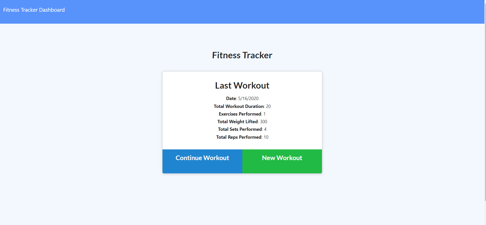

# Fitness Tracker - Mongoose.js

## Description

A simple workout tracker application utilizing all the components of a full stack web developer. This app requires the use of ***MongoDB*** as the database application, ***Mongoose.js*** as the language to make communications between the database and the backend of the application, and ***Express.js*** as the language to make axios calls from the front end to the backend and back.

The application was set up using a set up framework for the front end and the backend. The work done with the application was setting up the routes required for the three languages to communicate with eachother. API routes were set up to link the information from the backend, to the frontend, and from the backend to the Mongo database set up for the Fitness Tracker application.

The App is set up to render the last recorded exercise to the user with a simple interface, which can easily navigate to an input form for the user to create or update a workout. There is also a statistics page with many workouts presented in charts form utilizing the data obtained from each of the workouts in the database.

## Table of Contents

* [Description](#description)
* [Purpose](#purpose)
* [Technologies](#technologies)
* [Usage](#usage)
* [Credits](#credits)
* [License](#license)


## Technologies:

The technologies used to create this terminal application are as follows:
- JavaScript
- MongoDB
- Robo 3T
- Mongooose
- Express
- Node.js
- Node Package Manager
- GitHub
- GitBash terminal
- Heroku 
- Google

## Usage 
The **Fitness Tracker** project populates information saved in an external database created in MongoDB. This database is then manipulated using calls made by Express.js funcitons. 

A great exercise to better understand clean Express and how to create clean ***API CRUD*** for functioning backend.

The project utilized the terminal to visualize the calls being made to fetch the data

**Terminal Example:**
```
GET /api.js 304 1.212 ms - -
GET /workout.js 304 2.309 ms - -
GET /index.js 304 2.963 ms - -
GET /api/workouts 304 3.309 ms - -
GET /stats 304 0.932 ms - -
GET /style.css 304 0.455 ms - -
GET /stats.js 304 0.757 ms - -
GET /api.js 304 1.207 ms - -
GET /api/workouts/range 304 3.482 ms - -
GET /api/workouts/range 304 3.645 ms - -
```

This data was then routed using Express's Router.route functionality to perform *try{}catch{};* promise to determine if the information being routed had any errors:

**Example of try{}catch{};**
```
  getWorkouts: async (req, res) => {
    try {
      const workouts = await Workout.find({});
      if (!workouts) {
        return res.status(404).json({ error: 'No workouts found' });
      }
      return res.status(200).json(workouts);
    } catch (e) {
      return res.status(403).json({ e });
    }
  },
```


Using these languages makes the life of developer much easier buy giving them these tools to localize errors to it's source component; making debugging much easier in the long run. 

---
**GIF of Application**
[](./public/assets/fitnessTracker.gif "FitnessTracker Demo")
---


[Adrian'sGithub](https://github.com/adrianromero13)


## Credits

* Collaborators with folder structure: 
    - **[Adrianromero13](http://github.com/adrianromero13)**
    - **[Armande925](http://github.com/armande925)**
    - **[Markmesina](https://github.com/markmesina)**
    - **[Markyounan11](https://github.com/markyounan11)**

* UC Berkeley, Extensions Full Stack Development BootCamp Instructors & Assistants
    - Manny Jucaban
    - Musa Akbari
    - Amanda Crawford

* Google inc.           **[Google](https://www.google.com)**
* NPM Registry          **[NMP](https://docs.npmjs.com/)**
* GitHub                **[GitHub](https://github.com/)**
    
    


## License

[GNU General Public License v3.0](./LICENSE.txt)


## Contributing


[Contributor Covenant](https://www.contributor-covenant.org/)


---
Adrian Romero 2020 Fitness Tracker Project
